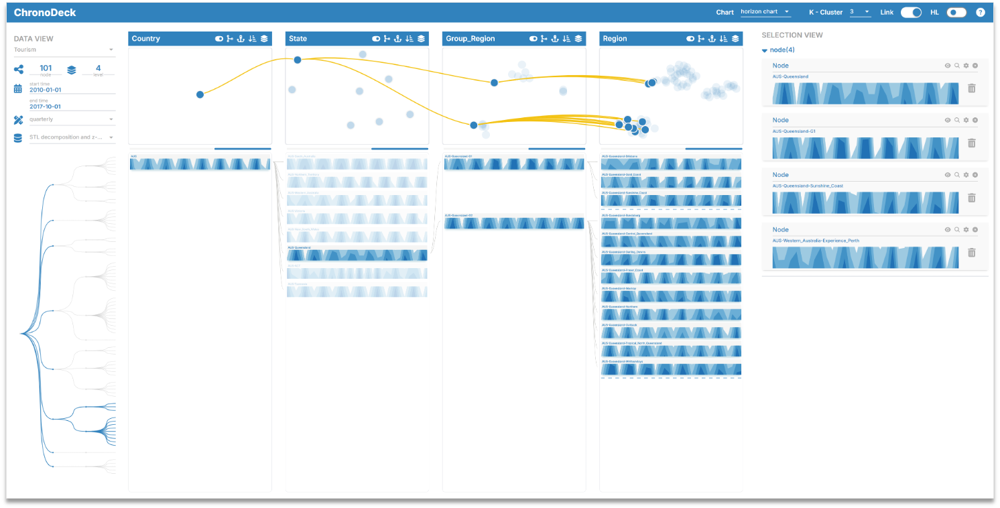

### Status of the Code
We are working hard to release more feature-complete version of the system in the future.

### Basic Introduction

ChronoDeck is a visual analytics system we have developed for hierarchical time series analysis. It leverages the combination of dimension reduction and small multiples visualizations in a multi-column layout, alongside interactions including highlight, align, filter, and select, to support six analytical tasks: **summarize**, **compare**, **relate**, **compute**, **rearrange**, and **reshape**, on four categories of targeted entities: **node**, **layer**, **path**, and **tree**.


*The user interface of ChronoDeck, consisting of data, explporation, and selection views.*


### Implementation

We implement ChronoDeck from two modules: frontend and backend. 

  #### Frontend

JavaScript, Vue.js, Vite, Vuex, and D3.

#### Backend Server

Python, Flask, numpy, and sklearn.

### Dataset of Hierarchical Time Series

Hierarchical time series is defined as in [1]: multiple time series that are hierarchically organized and can be aggregated at several different levels in groups based on products, geography or some other features.

In the repo, we include one dataset of hierarchical time series: the tourism dataset.


#### The Tourism Dataset

This dataset consists of three levels: country, state, and region.
It is introduced in [2] and can be downloaded in this [link](https://otexts.com/fpp3/extrafiles/tourism.xlsx).
In the paper, Holiday and visiting purposes are selected because they represent the majority of traveling activity. We also pre-select the seasonal component of each time series through STL decomposition for quick start. 
We will open source the complete computation module in the future if necessary. 

### Setup
#### Create conda env
```bash
conda create -n env_name python=3.8.17
```

#### Install Python Packages
```bash
cd ChronoDeck/backend
pip install -r requirements.txt
```

#### Install Dependencies

```bash
npm install
```

#### Run the Frontend

```bash
npm run dev
```

#### Run the Backend

```bash
python backend/server.py
```

### References

[1]: R. J. Hyndman, R. A. Ahmed, G. Athanasopoulos, and H. L. Shang, "Optimal combination forecasts for hierarchical time series," *Computational Statistics & Data Analysis*, vol. 55, no. 9, pp. 2579-2589, 2011. DOI: 10.1016/j.csda.2011.03.006. 


[2]: R. J. Hyndman and G. Athanasopoulos, *Forecasting: principles and practice*. OTexts, 2018.


