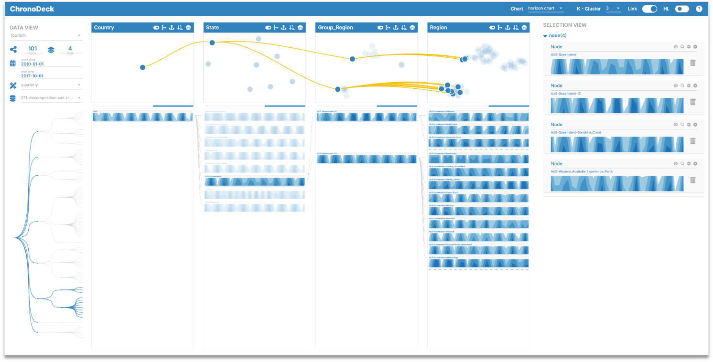

### ChronoDeck: A Visual Analytics Approach for Hierarchical Time Series Analysis

### Basic Introduction

ChronoDeck is a visual analytics system we have developed for hierarchical time series analysis. It leverages the combination of dimension reduction and small multiples visualizations in a multi-column layout, alongside interactions including highlight, align, filter, and select, to support six analytical tasks: **summarize**, **compare**, **relate**, **compute**, **rearrange**, and **reshape**, on four categories of targeted entities: **node**, **layer**, **path**, and **tree**.


*The user interface of ChronoDeck, consisting of data, explporation, and selection views.*


### Implementation

We implement ChronoDeck from two modules: frontend and backend. 

  #### Frontend

JavaScript, Vue.js, Vite, Vuex, and D3.

#### Backend Server

Python, Flask, numpy, and sklearn.

### Dataset of Hierarchical Time Series

Hierarchical time series is defined as in [1]: multiple time series that are hierarchically organized and can be aggregated at several different levels in groups based on products, geography or some other features.

In the repo, we introduce two datasets of hierarchical time series: the stock market dataset and the tourism dataset.

#### The Stock Market Dataset

This dataset consists of three levels: index, sector, and individual stock.
We obatin relevant time series through **Yahoo Finance API** and organize them in a tree structure.

#### The Tourism Dataset

This dataset also consists of three levels: country, state, and region.
It is introduced in [2] and can be downloaded in this [link](https://otexts.com/fpp3/extrafiles/tourism.xlsx).
In the paper, Holiday and visiting purposes are selected because they represent the majority of traveling activity. We also select the seasonal component of each time series through STL decomposition.

#### Data Structure
The dataset is stored in backend/data. Folder **Stock** and **Tour_Seasonal** store hierarchical time series of the stock market and tourism datasets.
- **Tree.json**: documents the hierarchical structure of the dataset.
- Other json files document the time series of each node in the tree, time series with the same parent node are stored in the same folder.


### Setup

#### Install Dependencies

```bash
npm install
```

#### Run the Frontend

```bash
npm run dev
```

#### Run the Backend

```bash
python backend/server.py
```

### References

[1]: R. J. Hyndman, R. A. Ahmed, G. Athanasopoulos, and H. L. Shang, "Optimal combination forecasts for hierarchical time series," *Computational Statistics & Data Analysis*, vol. 55, no. 9, pp. 2579-2589, 2011. DOI: 10.1016/j.csda.2011.03.006. 

[2]: R. J. Hyndman and G. Athanasopoulos, *Forecasting: principles and practice*. OTexts, 2018.